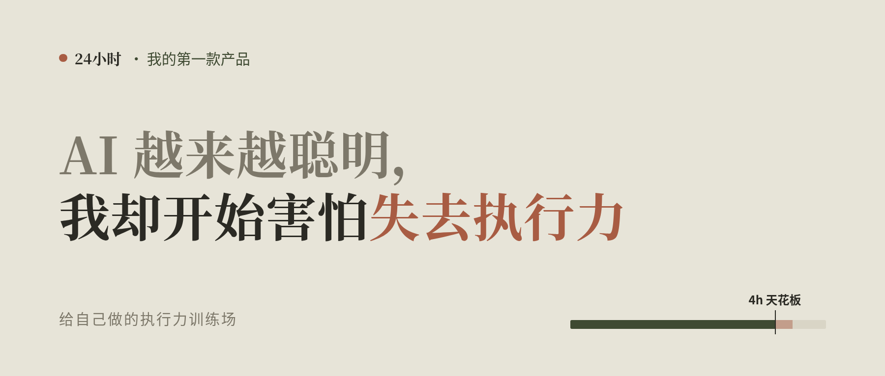
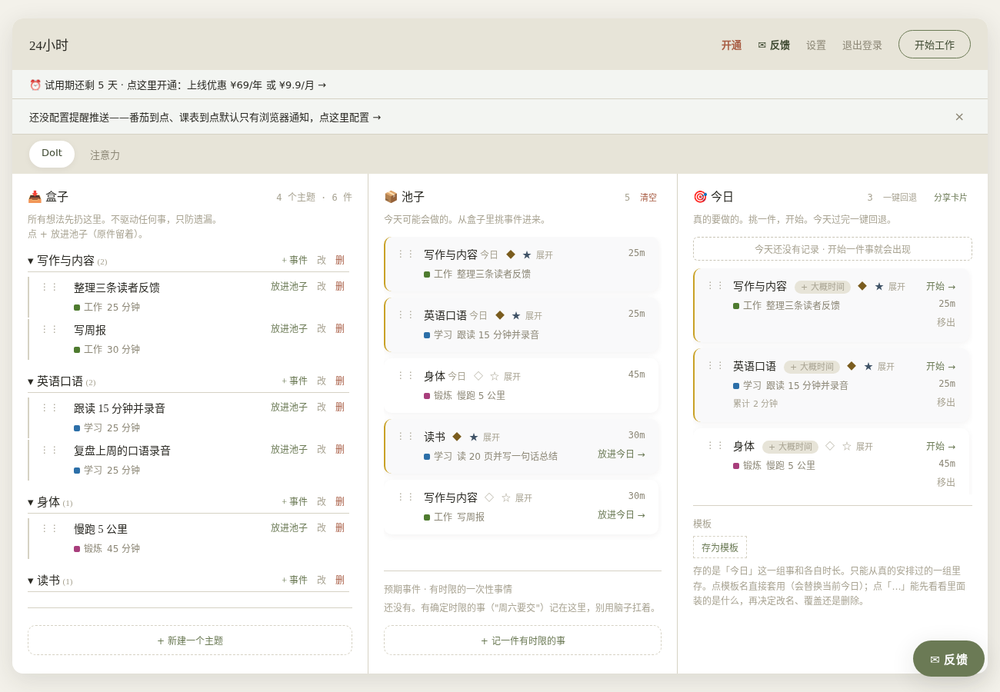
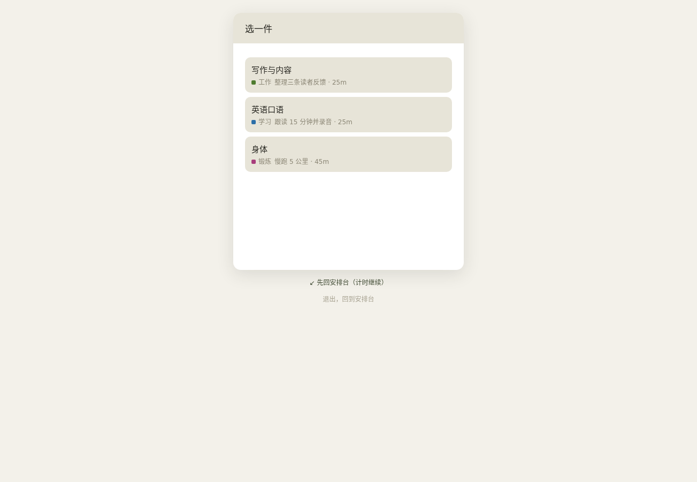
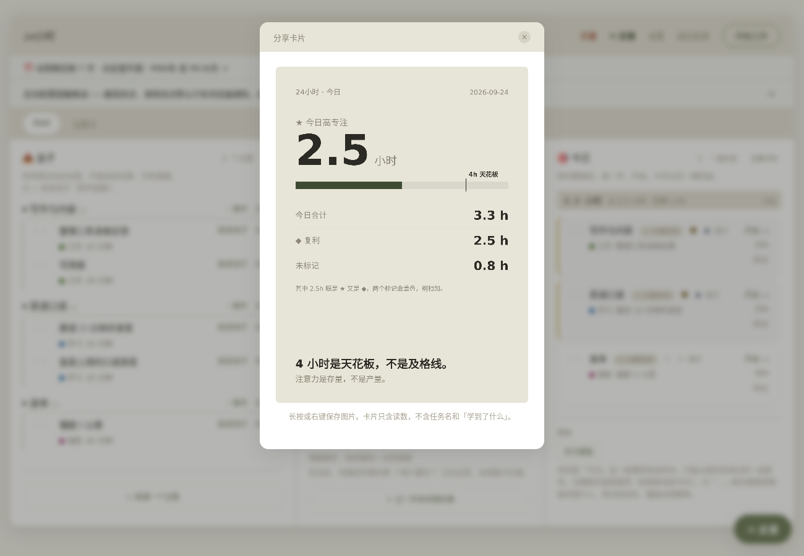
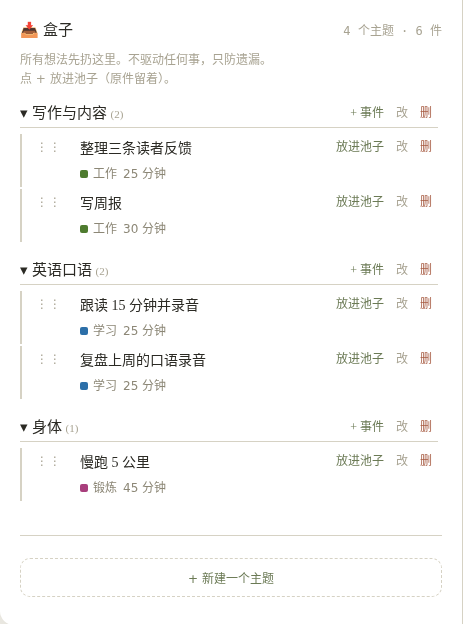
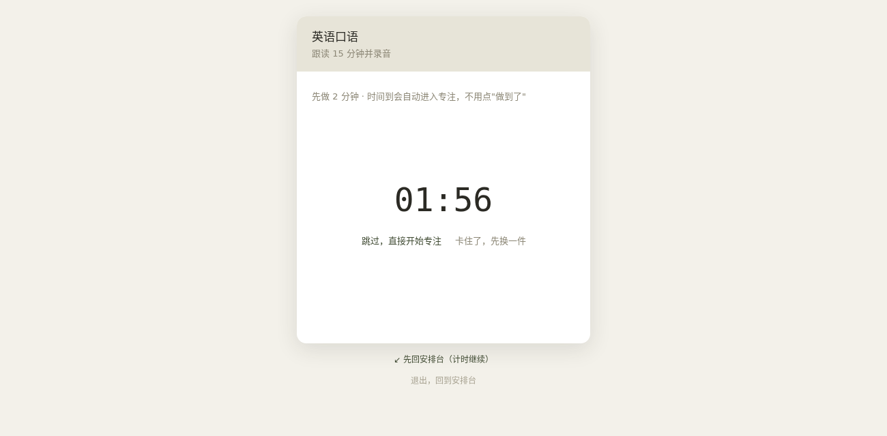
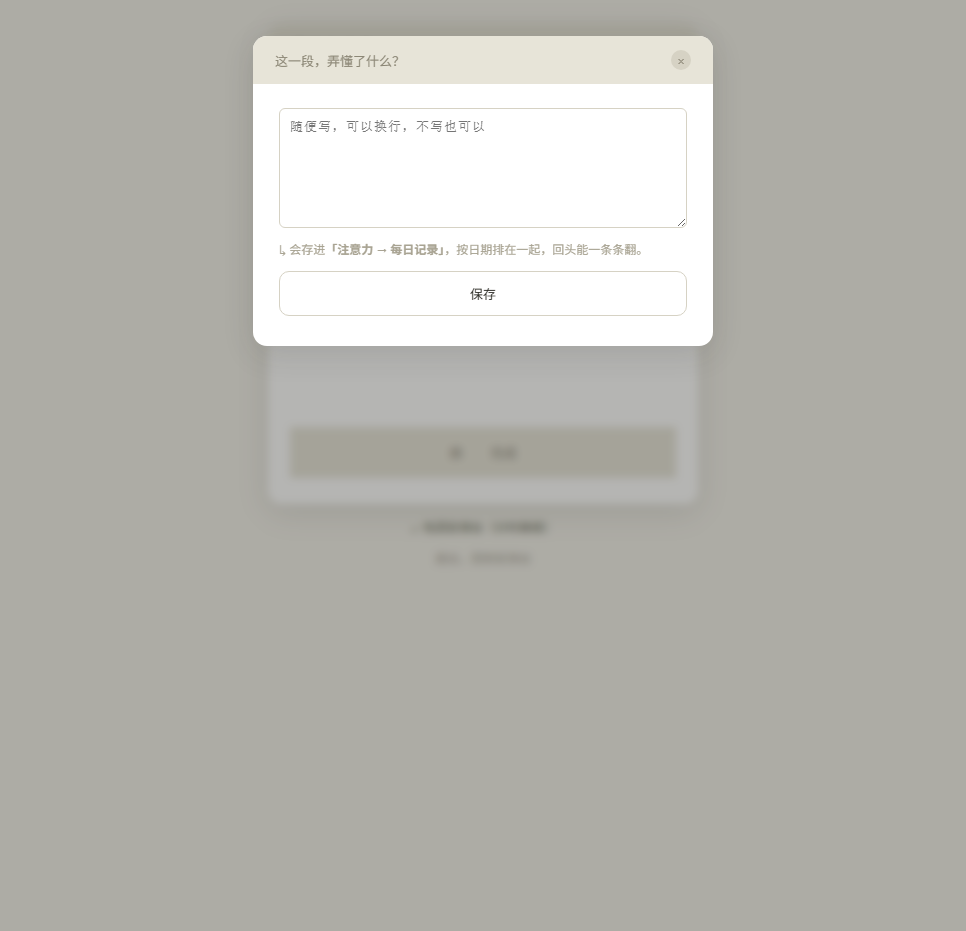
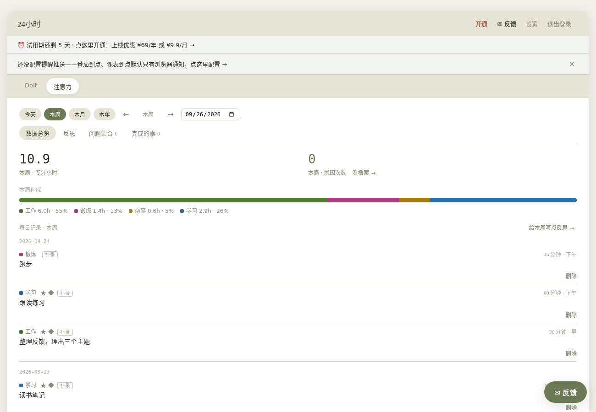
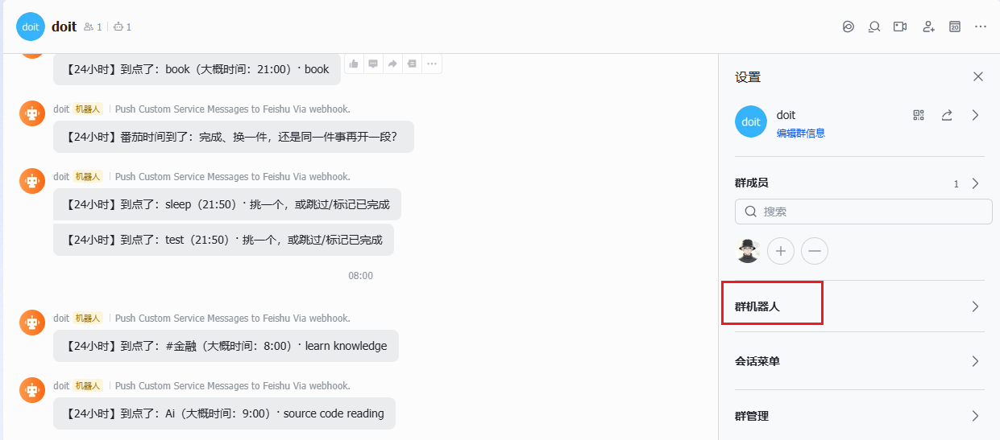
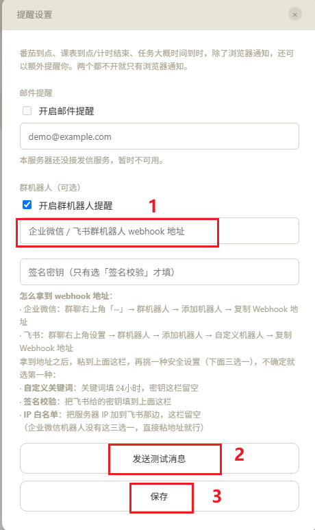

> 我的第一款产品「24 小时」，一个刻意训练注意力和执行力的效率工具。

## 一分钟看完

AI 越来越聪明，真正的瓶颈却常常是我自己。我很怕失去执行力，但只靠意志力撑不住。

执行力和倦怠（burnout），是我一直在解决的两个问题。以前每天排六件事，早中晚各两件，晚上一看只完成了三四件。清单、番茄钟和各种方法论，我都试过一段时间，最后不是效果不好，就是无法长期坚持。

后来我想明白：问题不是不够自律，而是这些方法都在帮人往一天里塞更多事情。真正有效的注意力每天只有那么多——**注意力是存量，不是产量。**

所以我做了「24 小时」，核心只有一句话：**减少大脑的调度开销，专注执行。**

它主要解决五件事：

1. **执行力**：今天只留几件，一次只做一件。每天高专注四小时是上限，不是目标。
2. **倦怠时不知道做什么**：想做的事情平时先放进「盒子」，状态差时从里面挑一件。
3. **开不了头**：先做两分钟，时间到后自动进入专注。
4. **复盘**：做完用一句话写下弄懂了什么，时间花在哪里一眼看清。
5. **提醒**：番茄到点或事情到点，可以推送到飞书，离开电脑也能收到。

电脑浏览器打开 [doitbox.cn](https://doitbox.cn)，新用户可以免费体验七天。

---

## 为什么在 AI 时代，我反而更在意执行力

我慢慢发现，真正的瓶颈不在 AI，而在我自己：**我能把 AI 用到什么程度，取决于我自己成长到了什么程度。**

如果我不成长，淘汰我的不会是 AI，而是那些比我更会使用 AI 的人。

成长靠主动思考，而思考不是凭空出现的。**亲手去做的过程，本身就是思考的原材料。** 不动手，脑子里就只有空想。

说实话，我很害怕失去执行力。焦虑的时候，我不想继续和情绪较劲，而是希望先动起来：**用行动替代情绪。**

于是有了「24 小时」——我给自己做的执行力训练场。下面每一个设计，都来自我长期工作中真正使用过的习惯。

## 我以前的一天

早上排好六件事，信心满满。晚上回头看，真正完成的只有三四件；剩下的要么没有开始，要么刚开头就被打断。第二天再把没做完的抄过去，同时加入新的事情。清单越来越长，人越来越累。

大多数效率工具关心的是产量：今天完成了多少件事。我更在意存量：今天还剩多少注意力。用完就是用完，硬撑不是高产，而是低效和消耗。

「24 小时」只有一个核心假设：**注意力是存量，不是产量。** 下面这些设计都从这句话生长出来。

## 1. 少放几件，一次只做一件

界面只有三栏，从左到右是：**盒子**（暂存所有想法）→ **池子**（近期准备推进）→ **今日**（今天真正要做）。每往右一步，事情就少一点。池子超过七件时，系统会提醒你：同时推进的事情越多，每一件轮到的次数越少。

点击「开始工作」后，只能从今日任务中**选择一件**。选定以后，屏幕上只保留这一件事和计时器。

中途可以换任务，但系统会先问一句：“下次从哪一步继续？”写下的内容会在下次开始时直接出现，避免重新回忆上下文。

每天的高专注时间有一条四小时刻度线。四小时不是医学标准，也不是必须完成的指标，而是我用来观察精力边界的一条产品刻度：没到不催促，超过也不奖励，只提醒自己该看看注意力去了哪里。

每件事情还可以标记：

- **★ 高专注**：需要全神贯注的事情，四小时刻度统计的就是这部分时间。
- **◆ 复利**：对长期成长有价值的事情，用来检查时间是否花在真正重要的方向上。

一件事可以同时拥有两个标记，也可以都没有。

**执行力不是做得多，而是把有限的注意力一次只放在一件事上。**

## 2. 盒子：倦怠时不必重新寻找方向

倦怠的日子真正难受的，不一定是事情本身，而是坐下来时大脑一片空白：今天该做什么？选择本身就在消耗所剩不多的注意力。

盒子把选择提前完成。平时看到想学、想尝试或感兴趣的事情，先随手放进去，不必当场安排。状态差的时候，再从过去真正感兴趣的事情里挑一件开始。

后来我发现，Sam Altman 在一篇关于[个人效率](https://blog.samaltman.com/productivity)的文章里也提到类似方法：用不同时间尺度的清单减少认知负担。他使用纸质清单，我把自己的版本做成了网页工具。

## 3. 先做两分钟

有时已经选好了事情，却仍然无法开始。那就先做两分钟。

两分钟结束后，系统会自动进入专注，不需要再点击“开始”。你不必下决心完成整件事，只需要先试两分钟。真卡住了，也可以换一件，不要求硬撑。

很多时候，启动比坚持更难。一旦开始，专注自然就能延续下去。

## 4. 用一句自己的话复盘

每完成一段工作，系统会问：“这一段，弄懂了什么？”

不写也可以。但我发现，强迫自己用一句话、用自己的语言说出来，才是在主动调用大脑。说得出来，往往才是真的理解了。

时间花在哪里也会变得清楚：工作、学习和锻炼各占多少，有多少投入长期复利。**时间是衡量人生的尺子，看得见，才知道有没有花在对的地方。**

## 5. 离开电脑后，提醒仍然存在

浏览器通知的问题是：一旦离开电脑，就收不到了。

所以番茄到点或事情的预计时间到了，除了浏览器通知，还可以推送到飞书或企业微信。我建立了一个只有自己的群，在手机上接收提醒。

每一条推送都在提醒我：“这件事还在等你。”它不是为了制造压力，而是减少遗忘和重新进入状态的成本。

## 其他功能

- **问题集合**：暂时想不通的好问题先保留，等待未来的连接。
- **补录**：线下完成的事情可以事后补记，避免工作时频繁切换工具。
- **模板**：常用的一天可以保存为模板，再一键套用。
- **分享卡片**：只展示数字，不包含任务名称，分享时不泄露具体内容。

## 做这个产品，我学到的

一开始我也在用 vibe coding 的方式开发，想到哪里写到哪里。后来逐渐转向 AI Native 的工作方式，中间甚至完整推倒重构过一次。

传统开发中，推倒重构非常痛苦。到了 AI 编程时代，执行成本降低了，真正困难的是心理上愿不愿意承认方向不对，并重新做出判断。

**产品的核心不是一次想出来的，而是在使用和修改中逐渐清楚的。** “注意力是存量”也是我使用很久之后才总结出来的：执行力不足和倦怠，背后可能是同一个资源分配问题。

## 适合谁

- 每天长时间使用电脑工作或学习的人。
- 想刻意训练自己、持续提升的人。
- 尝试过很多效率方法，却一直没有坚持下来的人。

目前它不适合：

- 主要希望在手机或平板上使用的人。目前只适配电脑浏览器。
- 需要团队协作和多人共享任务的人。它首先是为一个人设计的。

## 最后

「24 小时」是我自己每天都在用的工具，也是我作为独立开发者推出的第一款产品。

一些真实信息提前说明：

- 新用户免费体验七天，之后是 ¥9.9/月或 ¥99/年；不续费会变为只读，数据不会删除。
- 2026 年 10 月 30 日前开通年付为 ¥69/年；保持连续续费，后续仍按这个价格。
- 当前通过微信转账后人工开通，不会自动扣款，但可能需要等待我处理。
- 目前只适配电脑浏览器，手机和平板暂不支持。

如果你也试过很多方法，却一直坚持不下来，可以体验这个“管理注意力存量”的工具：

**👉 [打开 doitbox.cn](https://doitbox.cn)**

遇到问题或有建议，可以使用产品右下角的「反馈」按钮，也可以通过 [X / @chokebit3xp](https://x.com/chokebit3xp) 联系我。

---

## 附录：配置飞书提醒

需要先在飞书桌面端完成群机器人配置：

1. 创建一个只有自己的群。
2. 打开群设置 → 群机器人 → 添加机器人 → 自定义机器人。
3. 复制 Webhook 地址。这个地址不要公开。
4. 回到「24 小时」右上角设置 → 提醒设置。
5. 开启群机器人提醒，粘贴 Webhook 地址。
6. 发送测试消息；确认收到后保存。

如果不确定机器人的安全设置，可以选择“自定义关键词”，关键词填写 **24小时**。
