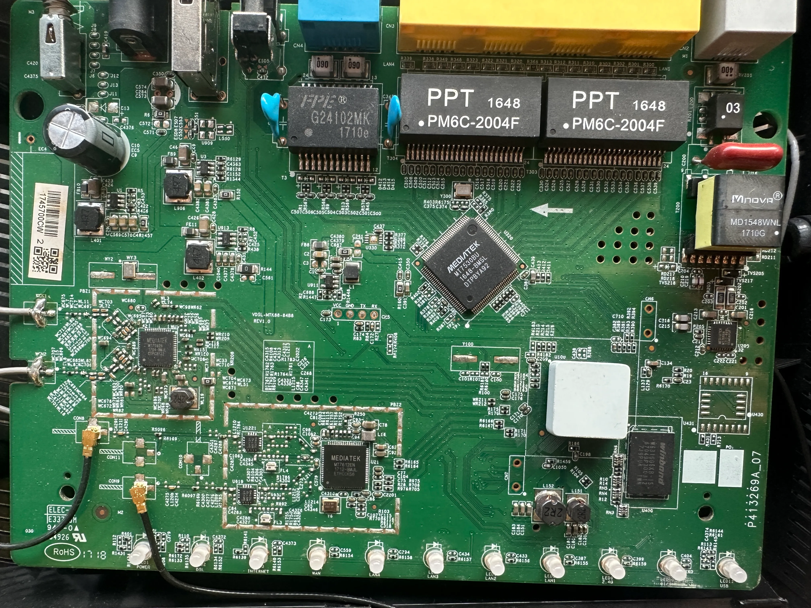
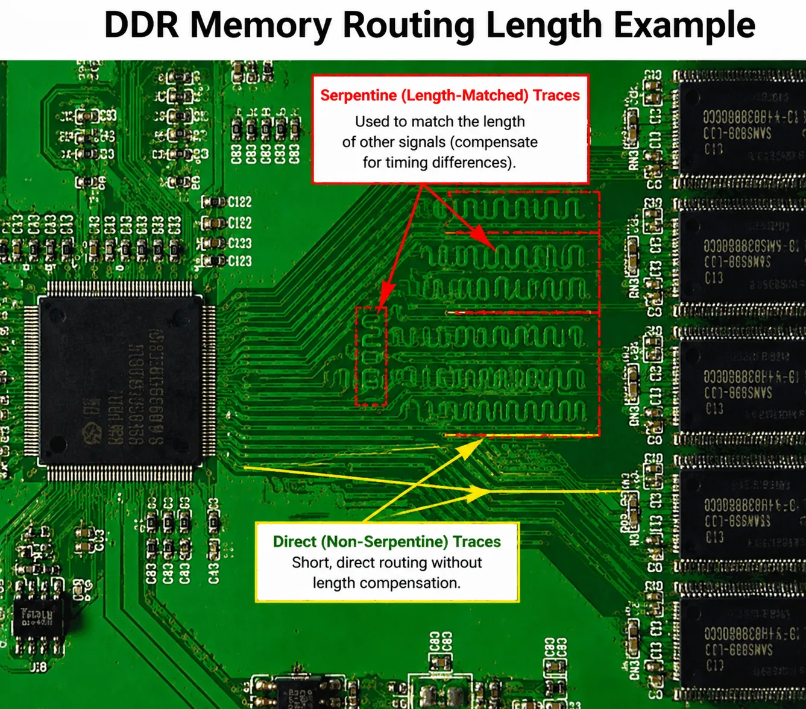
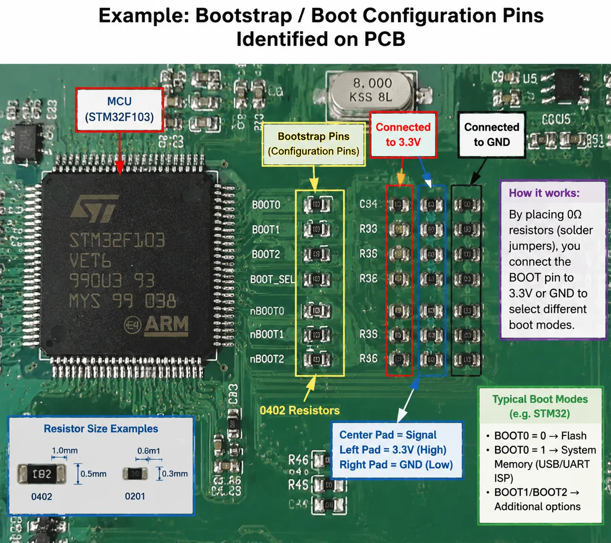

> Errors are inevitable — read critically.

## Contents

- **Pull-up / Pull-down Resistors**: The logical foundation of digital circuits, and why Flash chips need pull-down resistors.
- **Chip Pin Identification**: Universal pin-1 locating methods and the counterclockwise numbering rule.
- **The Three Storage Chips (SDRAM / NOR / NAND)**: Purpose, package, markings, and reverse-engineering value compared side by side.
- **Locating Firmware**: How board layout reveals which chip holds the firmware.
- **PCB Reverse Engineering in Practice**: Without silkscreen — serpentine traces → RAM, BGA → CPU, SOP → Flash.
- **Debug Interface Identification**: Pin count, layout, and telltale signs for UART / SWD / JTAG / Boot Pins.
- **Non-Standard Jumper Points**: Via matrices, I²C/SPI sniffing, test points, and blind circuit tracing.

---

## I. Pull-Up and Pull-Down Resistors

Pull-up and pull-down resistors are two common configurations used in digital circuits to hold a signal line at a defined logic level when it is not being actively driven.

Voltage and logic relationship:
- **Logic 1 (High Level)**: Typically equals the supply voltage (e.g., 3.3V or 5V).
- **Logic 0 (Low Level)**: Typically equals ground voltage (GND, i.e., 0V).

### 1. Pull-Up Resistor

- **Definition**: Connected between the power supply (Vcc) and the signal line. When the signal line is not driven, the resistor pulls it to logic high (1).
- **Purpose**:
  - Keeps the input at a defined high level when floating, preventing undefined states.
  - Commonly used for push buttons, switches, etc.
- **Example**:
  - Button not pressed → signal line connected to Vcc via pull-up resistor → logic high (1).
  - Button pressed → signal line shorted directly to ground, whose resistance is far lower than the pull-up resistor → logic low (0).

**Q: Why is a pull-up resistor needed? (Solving the "floating" problem)**

**A:** From a digital chip input pin's perspective, if it's connected to nothing (floating), it is highly susceptible to ambient electromagnetic interference, causing the level to bounce randomly between 0 and 1. This is a logic disaster — the chip has no idea what it's reading. The pull-up resistor's job: when nothing is actively pulling the line, forcibly drag it to high.

### 2. Pull-Down Resistor

- **Definition**: Connected between the signal line and ground (GND). When the signal line is not driven, the resistor pulls it to logic low (0).
- **Purpose**:
  - Keeps the input at a defined low level when floating.
  - Current is near zero with no external signal, creating a stable input state; current flows only when an external signal is present.
- **Example**:
  - Switch not pressed → signal line grounded via pull-down resistor → logic low (0).
  - Switch pressed → signal line connected to Vcc via switch → logic high (1).

### 3. When to Use Which

| Bus Idle State | Resistor Type | Typical Use Cases |
|---------------|---------------|-------------------|
| High | Pull-Up | UART RX, I²C (SCL/SDA) |
| Low | Pull-Down | Some Chip Select signals |

> **Bus idle state**: The default voltage level of a bus or interface when no data is being transmitted.

Common protocol idle states:
- **UART**: Idle is high. A high line means no data; a low (start bit) signals the beginning of transmission.
- **I²C**: Both SCL and SDA idle high. A falling edge on SDA while SCL is high = start condition.
- **SPI**: Idle state depends on Clock Polarity (CPOL) and Chip Select. Usually, the interface is idle when chip select is high.

### 4. Why Flash Chips Use Pull-Down Resistors (Stabilizing Logic 0)

When power is applied to a Flash chip, the controller/programmer reads pin states (address lines, data lines, mode select pins). These pins must stabilize at their specified logic levels the moment power is applied.

- **Problem with too large a pull-down resistor**: Large resistance → low current → leakage current / coupled noise / internal weak pull-ups can cause the level to drift → Flash fails to recognize control signals → read failure.

- **Analogy (water flow model)**:
  - Voltage source = water tank level
  - Resistor = pipe diameter
  - Current = water flow rate
  - Pull-down resistor too large = pipe too thin, flow insufficient to pull the water level down.

> **Conclusion**: Flash chips use pull-down resistors to ensure pin voltages are reliably held at logic low at power-on, preventing floating or interference from causing erroneous states, and ensuring the chip enters the correct operating mode.

### 5. Summary: Pull-Down vs. Pull-Up

| Characteristic | Pull-Down Resistor | Pull-Up Resistor |
|---------------|-------------------|------------------|
| **Default State** | Logic 0 (GND) | Logic 1 (Vcc) |
| **Primary Goal** | Keep system in "quiet / off" state | Keep system in "ready / enabled" state |
| **Safety** | Prevents accidental triggers, safer for data | Can inadvertently activate the chip |
| **Common Applications** | Mode selection, reset pins, write-protect pins | I²C bus, interrupt signals, handshake signals |

---

## II. Identifying Chip Pins

### Pin 1 Location Markers

- A hollow dot
- An arrow mark
- The number "1" printed directly

### Pin Numbering Rule

Starting from pin 1, pins are numbered **counterclockwise** (this applies to all chips).

---

## III. NAND Flash Data Handling Notes

### Core Concepts

- **Data Area**: Stores the actual content. What the programmer reads = data + ECC information.
- **OOB (Out of Band)**: The extra data region used to store ECC (Error Correction Code).
- **Actual space allocation**: Check the chip datasheet. A common layout is `0x800 (data) + 0x40 (ECC)`.
- **Runtime behavior**: When the program loads into memory, only the data content is loaded; the ECC data is not read into RAM.

### NOR Flash vs. NAND Flash

| Type | Purpose | Volatile | Typical Contents |
|------|---------|----------|------------------|
| SDRAM | Runtime memory | Yes | Code/data loaded at boot |
| NOR Flash | Boot + firmware (sometimes full rootfs) | No | Bootloader, Kernel, rootfs |
| NAND Flash | Storage | No | rootfs, config files, logs |

References:
- [NAND Flash OOB Explained](https://www.zhiwanyuzhou.com/index.php/2024/08/28/nand%e9%97%aa%e5%ad%98%e4%b9%8boob/)
- [MRCTF2022 IoT Challenge — NAND Data Analysis](https://www.zhiwanyuzhou.com/index.php/2022/06/03/mrctf2022-iot%e9%a2%98%e7%9b%ae%e4%b9%8bnand%e6%9c%89%e6%95%88%e6%95%b0%e6%8d%ae%e5%88%86%e6%9e%90%ef%bc%881%ef%bc%89/)
- [CSDN: NAND Flash Analysis](https://blog.csdn.net/weixin_45209963/article/details/124502211)
- [CTF IoT Analysis Examples](https://www.ctfiot.com/38677.html)

### Identifying Valid Data

> "Since there is no uniform format for BootLoader file structures, one must analyze regions further into the file, looking for patterned data blocks (e.g., all-0x00 regions, consecutive string regions, special file structures)."

These patterned regions help distinguish valid data from invalid data. Observing byte patterns allows you to reconstruct the correct byte ordering.

---

## IV. Identifying SDRAM / NOR Flash / NAND Flash

### Quick Comparison

| Type | Purpose | Volatile | Typical Contents |
|------|---------|----------|------------------|
| **SDRAM** | Runtime memory | ✅ Yes | Code/data loaded at boot |
| **NOR Flash** | Boot + firmware (sometimes full rootfs) | ❌ No | Bootloader, Kernel, rootfs |
| **NAND Flash** | Storage | ❌ No | rootfs, config files, logs |

### SDRAM (Synchronous Dynamic Random Access Memory)

- **Common markings**: `DDR`, `SDRAM`, `MT`, `H5`, `K4`

### NOR Flash

- Supports **XIP (Execute-In-Place)** — code can run directly from the Flash chip.
- **Characteristics**:
  - Smaller capacity (typically 8–64 MB)
  - SPI or parallel interface
  - 8-pin SOIC (SPI NOR) or TSOP package
- **Common markings**: `W25Q`, `MX25`, `S25`, `EN25`
- **Reverse-engineering value**: Easiest chip to dump, clean offsets, virtually no wear-leveling interference.

### NAND Flash

- Block-based storage, requires ECC.
- **Characteristics**:
  - Larger capacity (128 MB+)
  - TSOP-48 or BGA package
  - Numerous address/data lines
- **Common markings**: `MT29F`, `K9F`, `TC58`
- **Complications**: Bad blocks, ECC, wear leveling — raw dumps often appear "corrupt" without controller logic.

---

## V. Locating Firmware / Filesystem Position

### Step 1: Identify Storage Chips
- Read chip markings → search the part number
- Check the package type

### Step 2: Use Board Layout Clues
- Flash closest to the CPU → usually boot NOR
- Largest Flash chip → usually NAND (filesystem)
- SDRAM hallmarks: many length-matched traces, nearby termination resistors

### Step 3: Dump the Flash
- SPI NOR → use `flashrom`
- NAND → use a programmer, or desolder and use a reader

### Common Filesystem Layout Patterns

**NOR-only device**:
```
[ bootloader ][ kernel ][ rootfs ]
```

**NOR + NAND device**:
```
NOR:  bootloader + kernel
NAND: rootfs + data
```

> Once you know these patterns, you can often tell at a glance which chip to dump first.

### PCB Reverse-Engineering Tricks

- **Follow the boot pins**: SPI traces → NOR; wide parallel bus → NAND; DDR traces → SDRAM
- **UART boot logs**: Often print lines like `Loading kernel from SPI flash...` or `Mounting rootfs from NAND...`, giving you the answer instantly.

### Vulnerability Research Angle

| Target | Storage Type |
|--------|-------------|
| Bootloader bugs | NOR Flash |
| Web / service bugs | NAND rootfs |
| Runtime RCE (Remote Code Execution) | SDRAM only |

> **Attack surface mapping starts from memory type.**

---

## VI. Reverse-Engineering a PCB

When you cannot read chip silkscreen markings, PCB reverse engineering relies on layout logic, trace characteristics, peripheral component patterns, and signal integrity design principles.



### 1. Locate the CPU / SoC (System on Chip)

- **Central role**: The BGA (Ball Grid Array) chip with the most pins, largest package, and densest routing.
- **Bus hub**: All signals converge here. Massive numbers of traces radiate out to RAM, Flash, Ethernet, etc.
- **Power characteristics**: Surrounded by multiple inductors (square black components) and many small decoupling capacitors, since the main controller requires multiple low-voltage, high-current supply rails.

### 2. Locate DRAM (Memory)

- **Length-matched traces (serpentine traces)**: The most reliable indicator of RAM. To ensure high-speed data synchronization, traces between the CPU and RAM must be equal in length, appearing as parallel wiggly lines.
- **Adjacent to the CPU**: DDR signals operate at extremely high frequencies; to minimize interference, the RAM chip is placed right next to the CPU.
- **Package**: Typically a rectangular BGA.



### 3. Locate Flash (Firmware Storage)

- **Relatively sparse routing**: SPI Flash usually has only 8–16 pins, with far simpler routing than RAM.
- **Common packages**: SOP-8 or wide SOP-16; large-capacity NAND Flash uses rectangular multi-pin TSOP.
- **Position**: Close to the CPU, but distance requirements are less strict than for RAM.

### 4. Locate Debug Ports (UART)

- **Header/pad characteristics**: Usually 3–4 consecutive unpopulated pads or soldered pin headers.
- **Signal logic**: One pad connected to the large ground plane (GND), one to 3.3V power, and the other two (TX/RX) routed directly to the CPU.
- **Silkscreen hints**: May have `VCC, GND, TX, RX` labels, or no markings at all but neatly aligned near the CPU.

### 5. Other Functional Modules for Triangulation

| Module | Identifying Features | Reverse-Engineering Logic |
|--------|---------------------|---------------------------|
| Network Interface (PHY / Switch) | Near RJ45 jack, connected to a black rectangular network transformer | The chip on the other side of the transformer = switch chip or CPU |
| RF (Wi-Fi / Radio) | Under a shield can, connected to black or grey antenna coax | Follow the antenna cable to its endpoint = wireless chip (or directly to SoC if integrated) |
| PMU (Power Management Unit) | Near the DC power jack, surrounded by large inductors and electrolytic capacitors | Handles voltage conversion, supplies power to CPU and RAM |

### Reverse-Engineering Cheat Sheet

1. **Follow the traces**: Serpentine → RAM, thick traces → power, dense traces → CPU.
2. **Follow the peripherals**: Ethernet jack → PHY, antenna → RF, power jack → PMU.
3. **Read the package**: Large square → SoC, rectangle → RAM, small rectangle → Flash.

---

## VII. Debug Pin Reverse Identification

### 1. Bootstrap Pins (Boot Configuration Pins)

These are not used for ongoing communication, but determine where the chip boots from (Flash boot vs. USB programming mode).

- **How to spot them**:
  - A cluster of neatly aligned small resistors (0402 or 0201 package) near the CPU. One end connects to CPU signal lines; the other end connects to either a high level (3.3V/1.8V) or ground.
  - Three pads side by side: the middle one carries the signal, the outer two go to high and ground. Soldering a 0Ω resistor to one side changes the boot mode.
- **Reverse-engineering logic**: If you need to force the chip into programming mode (e.g., to bypass the original bootloader), find these resistors and short them.



### 2. Common Debug Interfaces at a Glance

| Interface | Pin Count | Typical Layout | How to Identify |
|-----------|-----------|----------------|-----------------|
| **UART** | 3–4 | 1×4 linear | TX/RX show voltage fluctuation; levels typically 3.3V |
| **SWD** (ARM only) | 2–4 | 1×4 or pads | ARM cores only; CLK pin shows a steady frequency |
| **JTAG** | 5–20 | 2×N array or continuous pads | Matching resistors between pins; signals route directly to CPU core |
| **Boot Pin** | 1–4 | Resistor cluster | Near CPU; connected to VCC or GND via resistors |

---

## VIII. Finding Jumper Points on Non-Standard Interfaces

Once you've ruled out UART, SWD, and JTAG, you're dealing with non-standard debugging or low-level hardware configuration.

### 1. Find Bootstrap / Strapping Pins

- Look for rows of 0Ω resistors or unpopulated resistor pads near the CPU (one end to a signal, the other to 3.3V or GND).
- Changing one pin's level (e.g., high → low) may force the system into Recovery Mode — which is a form of debugging in itself.

### 2. Probe Through the Via Matrix

- The vias surrounding a BGA chip are natural test points.
- **Method**: Use a multimeter in continuity mode. Hold one probe on a Flash chip pin (e.g., CLK), and sweep the other probe across the via array near the CPU to identify which vias connect directly to the core bus.
- **Scrape the solder mask**: For vias without exposed pads, gently scrape off the green solder mask with a scalpel to expose the copper underneath, allowing you to solder a jump wire for logic analysis.

### 3. Find I²C / SPI Sniffing Points

- **Targets**: 8-pin or 16-pin small chips on the board (e.g., EEPROMs or sensors).
- **I²C**: Look for a pair of pull-up resistors (typically 4.7kΩ) connected to 3.3V.
- **SPI**: Look for pins 1, 2, 5, and 6 of a Winbond Flash chip.
- These buses often carry critical configuration data or encryption keys. Hooking up a logic analyzer to these points enables side-channel debugging.

### 4. Identify Isolated Test Points (TP)

Small gold circles scattered across the board, often labeled with `TP` numbers:

- **Static TPs**: Measure voltages (1.1V core, 1.8V RAM, 3.3V I/O).
- **Dynamic TPs**: Key clock signals (CLK) or reset signals (RESET).
- **How to tell**: Probe with an oscilloscope. A steady 25MHz or 40MHz sine wave = crystal oscillator clock test point. A signal that jumps at power-on then stays high = Reset pin.

### 5. Blind Circuit Tracing

1. Identify the ground plane (GND): Large copper pours or the negative terminal of electrolytic capacitors.
2. Trace the power tree: Start at the DC power jack → follow inductors (components marked `1R2` or `4R7`) → the vias after the inductor are the main power rails.
3. Map interconnects:
   - CPU → RAM: Groups of length-matched serpentine traces.
   - CPU → Ethernet: Trace backwards from the network transformer pins.
   - CPU → Storage: Trace backwards from the Flash chip's 8 pins.

### The Golden Jumper Location

> **The 6 SPI bus traces between the CPU and the Flash chip.**

Once you attach jump wires to the SPI bus, you can read the entire instruction stream at runtime — and even attach your own external Flash to replace the original firmware.
